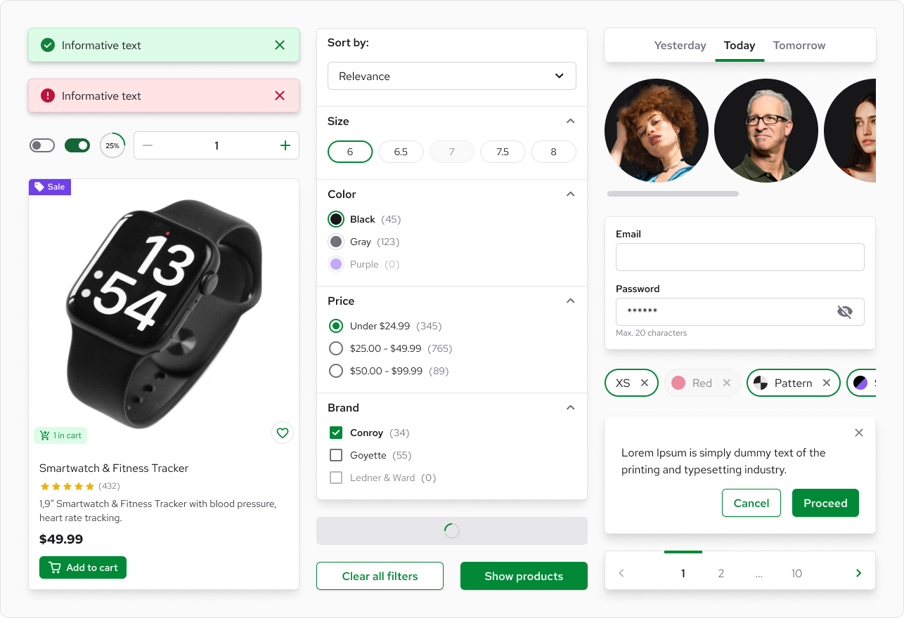
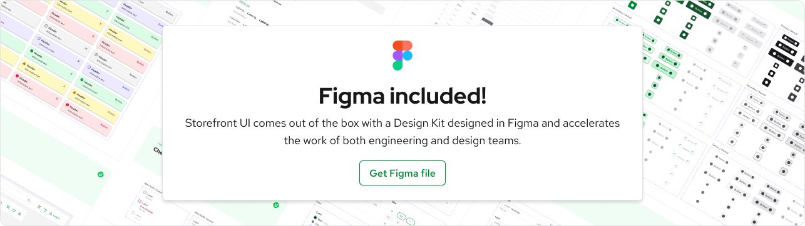

  

<h3 align="center">
  Framework-agnostic UI library and Design System for eCommerce based on <a href="https://tailwindcss.com/">TailwindCSS</a>.
</h3>

    
    
    
    
    

  
  

## What problems does Storefront UI solve?

Like any UI Library / Design System the main goal of Storefront UI is to **accelerate the development process** by providing an opinionated set of premade components, utilities and patterns.

There is a lot of the things you have to take care of to build good user interfaces:

🔹 **Developer/Designer workflow**: Storefront UI comes out of the box with Figma files - a pixel-perfect representation of your code that your design and engineering teams needs to stay aligned. 

🔹 **Performance:** Poorly written and overcomplicated components are often the performance bottleneck ruining the experience of your users. **All standard eCommerce pages that we've built with Storefront UI hit 95-100 on Lighthouse**! (mobile performance measured using [PSI](https://pagespeed.web.dev/))

🔹 **Accessibility:**  Web Accessibility is more than an ethical requirement in US: [it’s also legal](https://adasitecompliance.com/website-accessibility-legal-requirement/) and you risk fines if the justice department finds you guilty.  At the same time building accessible components takes a lot of time and requires specific domain knowledge. **Storefront UI components are WCAG AA compliant out of the box!**

But let's be honest, almost all established UI libraries can solve that. **Here's what's Storefront UI is best at::**

🔸 **Customization:**  Most of the UI libraries out there fail when components need to be heavily customized. You suddenly find yourself working against your library just to achieve the desired look. Storefront UI is built for complex cases. We ship a set of small and flexible _base components_ like `Button`, `Checkbox` or `Modal` that can be used to build more complex ones. We also deliver more complex examples (aka _Blocks_) like `ProductCard` or a different checkout steps as copy-pasteable code using Storefront UI components and Tailwind utilities.

In addition, Storefront UI fits perfectly complex UI setups where one library is inherited and customized by multiple projects differing visually.

🔸 **Scaling:** The more your application grows the less maintainable your UI becomes. By providing the right building blocks and using Tailwind CSS we made sure that your UI will be easy to maintain and won't negatively impact your performance even on a large scale. 

🔸 **Focus on eCommerce** Storefront UI comes out of the box with components specific to eCommerce like `ProductCard`, `QuantitySelector` and even checkout components

## What comes out of the box? 🎁

- **Base Components** - beautiful, fast and fully accessible components like `Input` `Checkbox` `Button` that you can use to quickly build more complex structures
- **Blocks** - complex, copy-pasteable examples like `ProductCard` or checkout steps.
- **Composables** like `useDropdown` that abstract complex UI interactions
- **Tailwind preset** that maps tailwind config to CSS variables and provides few SFUI-specific defaults
- **Typography** package simplifying usage of 3rd party fonts
- **Figma** file with pixel-perfect representation of SFUI components based on tailwind properties

## Contributing

We believe that the best software is made when a lot of people with different views collaborate on it. We welcome all contributions to Storefrotn UI.

You can become contributor not only by writing code:

- Contribute to documentation
- Write an article or tutorial
- Help others on our [Discord server](https://discord.vuestorefront.io) 
- Report a bug
- Do a talk about Storefront UI at your local meetup

We are grateful for all kind of contributions. If you don't know where to start check out our [contribution guide](./CONTRIBUTING.md) or ask for help on [Discord](https://discord.vuestorefront.io)

## Links

- [Documentation](https://docs.storefrontui.io/v2/)
- [Playground Vue](https://play-vue.vuestorefront.io)
- [Playground React](https://play-react.vuestorefront.io)
- [Discord](https://discord.vuestorefront.io)
- [Vue Storefront](https://vuestorefront.io)
