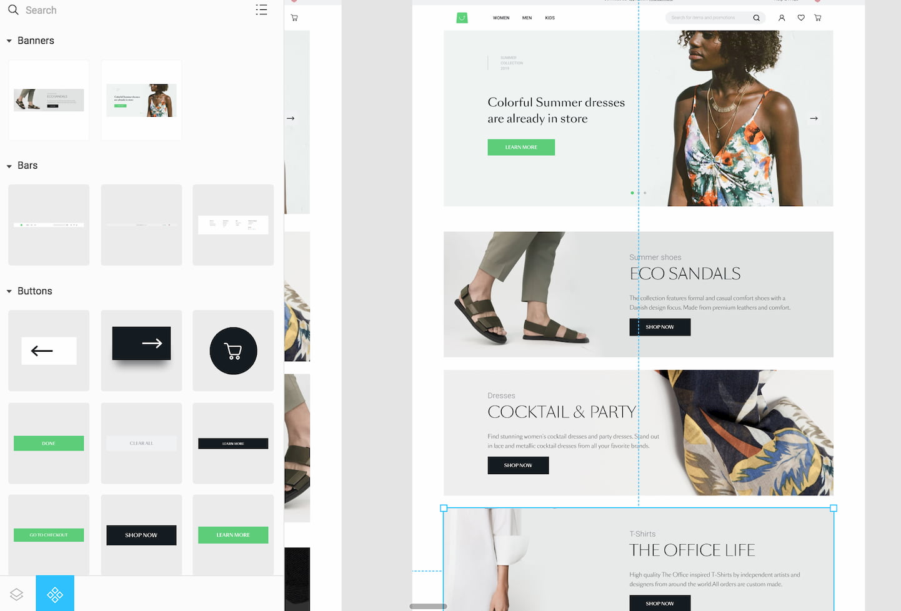
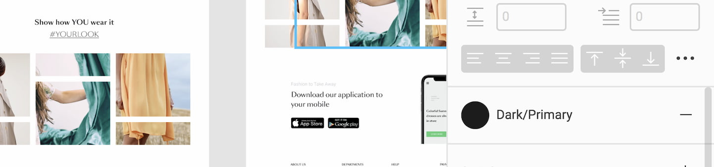

# How to work with our Figma designs

Our designs you can find [here](https://www.figma.com/file/N0Ct95cSAoODNv7zYS01ng/Storefront-UI-%7C-Design-System?node-id=127%3A1054).

While working with our figma designs there are two concepts that you need to be familiar with:

1. All of the components (not always with the names same as in a code) can be found under 'components' section in left bottom corner.

2. Most of the components have style applied on them. It means that if you click on a text field of particular element you can find the name of a style (instead of raw color/size) referring to styleguide. You can find them in global SCSS vars.

